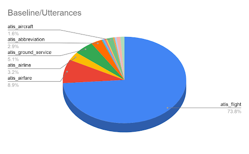
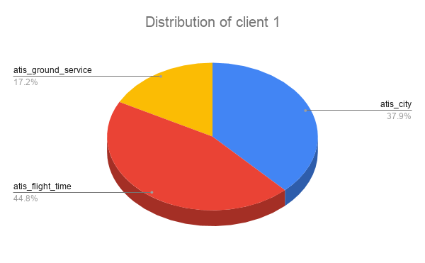
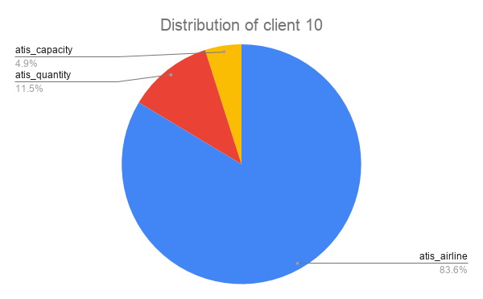
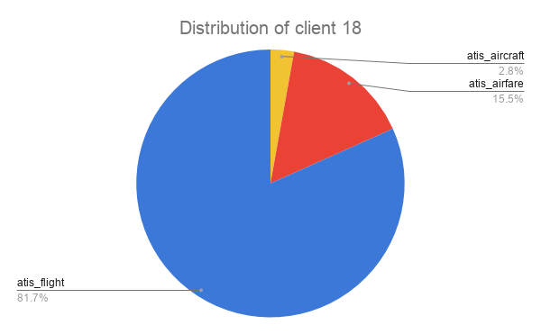
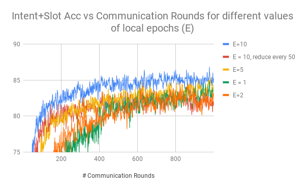
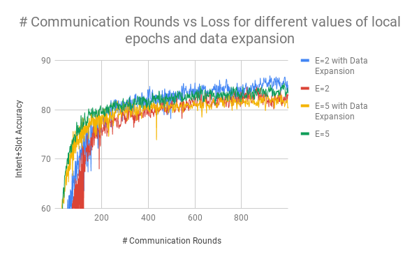
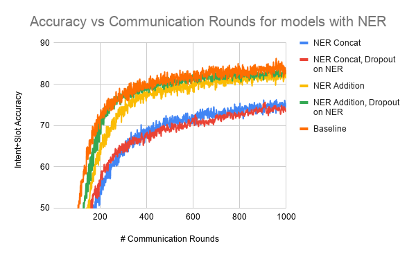

# Federated Learning Simulations on the ATIS dataset

## Model Details
This mode uses a three layer transformer to predict the intent and the corresponding slots for a given query. The concatenation of contextual embedding generated by the transformer encoder layer is used to predict the query intent while the decoder is used to predict the slot tokens.

## Dataset Used

### ATIS
The ATIS dataset is a standard benchmark dataset that is widely used as a joint intent-slot prediction task. ATIS Stands for Airline Travel Information System and consists of queries regarding air fares, availability of flights, etc.

The dataset consists of 4479 training instances, 500 validation instances and 893 test instances. The training set consists of instances belonging to 21 different intent types. Each token in a query utterance is aligned with slot filling IOB labels. Additionally, the dataset is highly skewed with approximately 74% of the training instance belong to the same intent. The intent-wise distribution of the ATIS dataset is shown below:

 The dataset consists of three files - **seq.in** (the input queries), **seq.out** (the ground truth slots) and **label** (the query intents).

A sample structure of the dataset is shown below:

`Input: i want to fly from baltimore to dallas round trip`

`Intent: atis_flight`

`Slots: O O O O O B-fromloc.city_name O B-toloc.city_name B-round_trip I-round_trip`

## Description of files

- **model_layers.py** : Defines the custom Keras layers of the transformer model.
- **data_utils.py** : Defines helper function for processing the data.
- **model_utils.py** : Defines evaluation metrics for the training process.
- **generate_splits.py** : Defines functions to splits the data into IID and non-IID partitions.
- **train_model.py** : Defines the pipeline for training the model.

## Usage

Use the following command to train the model on a given dataset:

`python train_model.py --dataset='atis'`

## Evaluation Metrics
- **Intent Accuracy** - Percentage of queries for which intents were predicted correctly.
- **Slot F1 Score** -  F1 score of the slots predicted based on IOB2 tagging.
- **Intent+Slot Accuracy** - Percentage of queries for which both slots and intents were predicted correctly.

## Split Generation

### IID Splits
To generate IID splits, the training instances were first randomly shuffled and then then equally partitioned among 30 clients with each client having 149 training instances.

### Non-IID split generation

To generate non-IID splits of the dataset, each client is assigned training instances only from a subset of intent types and each client will have different subsets of intents. Additionally, instances of a given intent type will be distributed among multiple clients. A randomly generated multinomial distribution is used to determine the distribution of intents for each client.

A sample of the distribution of few clients is shown below. In this example each client had training samples from atmost 3 intent types and each intent type was distributed among 3 clients. 

    
    

## Experimentation Results

### Baseline Non Federated model metrics

| Dataset | Split | Slot (F1) | Intent (Acc) | Intent+Slot (Acc) |
|---------|-------|-----------|--------------|------------|
| ATIS    | Valid | 96.57%    | 97.00%       | 88.20%     |
|         | Test  | **94.97%**| **94.73%**   | **83.54%** |

### IID Splits

- Number of clients : 30
- Training instances per client : 149 instances
- Rounds Trained : 1000

| Dataset | Split | Slot (F1) | Intent (Acc) | Intent+Slot (Acc) |
|---------|-------|-----------|--------------|------------|
| ATIS    | Valid | 95.25%    | 97.60%       | 85.80%     |
|         | Test  | **94.41%**| **95.07%**   | **82.19%** |

### Non-IID Splits 

- Number of clients : 21
- Training instances per client : 6 - 1329 instances
- Rounds Trained : 1000

#### Setup 1 

- Number of clients per round of federated training : 21 clients

| Dataset | Split | Slot (F1) | Intent (Acc) | Intent+Slot (Acc) |
|---------|-------|-----------|--------------|------------|
| ATIS    | Valid | 93.39%    | 97.00%       | 84.80%     |
|         | Test  | **92.47%**| **95.18%**   | **80.63%** |

#### Setup 2

- Number of clients per round of federated training : 10 clients

| Dataset | Split | Slot (F1) | Intent (Acc) | Intent+Slot (Acc) |
|---------|-------|-----------|--------------|------------|
| ATIS    | Valid | 94.57%    | 96.80%       | 85.50%     |
|         | Test  | **93.00%**| **94.96%**   | **80.40%** |

### Effect of local epochs on number of communication rounds required

The following graphs shows the effect of training for many local epochs between federated averaging steps.

   

The graphs show that for the intent prediction task, allowing the local models to train for more local epochs between averaging steps significantly decreases the number of communication rounds require to reach the same loss and consequently decreases the overall communication cost of training the model.

The following table shows the decrease in the number of communication rounds requires to achieve a 80% intent+slot accuracy on the ATIS validation dataset.

| Local Epochs (E) | # Communication Rounds | Reduction |
|------------------|------------------------|-----------|
| 1                | 401                  | 1.0x      | 
| 2                | 287                  | 1.40x      | 
| 5                | 146                  | 2.75x      | 
| 10 (decrement every 50 rounds)                | 132                  | 3.03x      
| 10               | 72                  | 5.57x      | 

However, it is generally not advisable to increase the number of local epochs by a lot as this could result in  the local client models to over-fit on the local dataset (local models move towards the local minimum rather than the global minimum) resulting in a increased noise in the system.

### Data Augmentation Experiments

Data augmentation can be used to aggressively train the federated model by generating additional synthetic instances. This also helps reduce overfitting of the local client models to the local datasets and thus reducing the noise that the server side model gets.

In this experiment the Augmentation was carried out in 2 steps. First, all the training instances were templatized by replacing the actual argument tokens by a placeholder token type. Additionally, the various instances of each argument type were also stored. Then, to generate synthetic data the placeholder tokens in the generated templates were replaces by a randomly selected instance of that  argument type. 

An example of the process is shown below:

- Actual training instance : How many flights from Denver to Austin.
- Generated template : How many fights from FROM_CITY to TO_CITY.
- Argument instances : 
  - FROM_CITY : Denver, Seattle, Boston
  - TO_CITY : Pennsylvania, California, New York
- Generated Synthetic examples:
  - How many fights from Seattle to California.
  - How many fights from Denver to New York.

In this experiment the dataset was augmented with additional ~3400 synthetic examples. The performance of the models with data expansion were evaluated on different values of local epochs as well.

The following graphs compares the loss graphs and the validation accuracies for different settings.

   

#### Observations

- With 2 local epochs per federated round:
  -  The model with data expansion achieves 80% accuracy on the validation set 1.35x times faster that without data expansions.
  -  Best validation accuracy with data expansion is 87% against the 84.6% achieved by the model without augmentation.
-  With 5 local epochs per federated round:
   -  The model loss decreases significantly faster than the model without data expansion in the first 100 communications rounds.
   -  However, after 100 rounds the model performance is similar to the model without data expansion.

### NER Annotations

By analyzing the model's performance on the validation set, we found that the model has trouble differentiating between cities, states and airport names. So, we thought that NER annotations could probably help the model improve upon these mistakes.

This experiment is meant to mimic the scenario where on-device annotations could be used to annotate the training data as well.

We used the CoreNLP annotator released by Stanford to annotate the training data. A sample annotation generated by the NER annotator of CoreNLP is:

- Query : i'd like a twa flight from las vegas to new york nonstop
- NER Annotation : O O O ORGANIZATION O O CITY CITY O STATE_OR_PROVINCE STATE_OR_PROVINCE LOCATION

The annotator however does have false positives. In the above case, nonstop was predicted as a LOCATION by the NER annotator.

We experimented with two different ways of incorporating NER information into the model.
- Concatenation : The embedding of the NER was concatenated with the embedding of the input tokes and passed into the transformer.
- Addition : The embedding of the NER was added with the embedding of the input tokes and passed into the transformer.

   

#### Observations

- With NER Concatenation the model overfits the training set as the model achieves the least training loss with concatenation but performs poorly on the validation set. Another reason for the poor performance on the validation set could be because of the incorrect NER annotations (false positives, Airports labelled as cities).
- While the NER addition model performs better than concatenation, it still does't provide any qualitative improvements on the validation set. The incorrect NER annotations could again be the reason on thie case.
s
### Error Analysis

The major types of errors made by the model (on the validation data) are described below along with some examples.

- Confusion between to/from, arrive/depart/return

  - Input : what is the earliest arrival in salt lake city of a flight from toronto
  GT slots :   O O O B-flight_mod O O B-toloc.city_name I-toloc.city_name I-toloc.city_name O O O O B-fromloc.city_name
  Pred slots : O O O B-flight_mod O O B-fromloc.city_name I-fromloc.city_name I-fromloc.city_name O O O O B-fromloc.city_name

  - Input : what's the latest flight out of denver that arrives in pittsburgh next monday
  GT slots :   O O B-flight_mod O O O B-fromloc.city_name O O O B-toloc.city_name B-arrive_date.date_relative B-arrive_date.day_name
  Pred slots : O O B-flight_mod O O O B-fromloc.city_name O O O B-toloc.city_name B-depart_date.date_relative B-depart_date.day_name

- Alignment Errors

  - Input : show me the costs and times for flights from san francisco to atlanta
    GT slots :   O O O O O B-flight_time O O O B-fromloc.city_name I-fromloc.city_name O B-toloc.city_name
    Pred slots : O O O O B-flight_time O O O O B-fromloc.city_name I-fromloc.city_name O B-toloc.city_name

  - Input : what is fare class h
    GT slots :   O O O O B-fare_basis_code
    Pred slots : O O O B-fare_basis_code __EOS

- Errors due to unknown words in the input

  - Input : i'm flying from boston to the __UNK area
    GT slots :     O O O B-fromloc.city_name O O B-toloc.city_name I-toloc.city_name
    Pred slots : O O O B-fromloc.city_name O O O O

   - Input : please list the flights from baltimore to san francisco on __UNK
    GT slots :   O O O O O B-fromloc.city_name O B-toloc.city_name I-toloc.city_name O B-depart_date.day_name
    Pred slots : O O O O O B-fromloc.city_name O B-toloc.city_name I-toloc.city_name O O

- Confusion between airport names and city names and state names

  - Input : which airline serves denver pittsburgh and atlanta
    GT slots :   O O O B-fromloc.city_name B-fromloc.city_name O B-fromloc.city_name
    Pred slots : O O O B-fromloc.city_name O B-toloc.city_name O

  -  Input : i need information for ground transportation denver colorado
    GT slots :   O O O O O O B-city_name B-state_name
    Pred slots : O O O O O O B-city_name I-city_name

