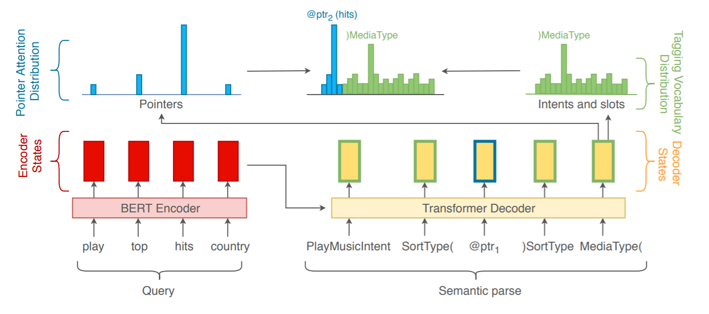
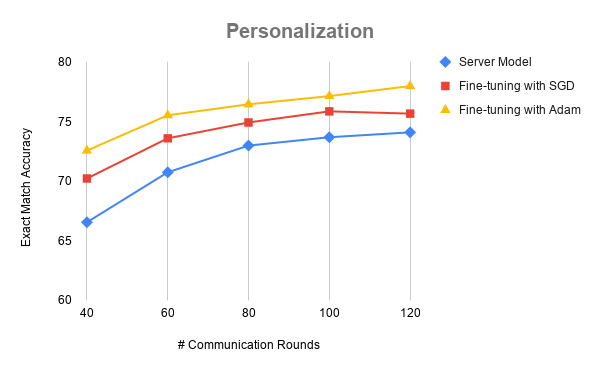

# Federated Learning Simulations on the TOP dataset

## Model Details
This model used for the experiments was based on Sequence to Sequence Models and and Pointer Generator Network that was introduced in [this paper](https://arxiv.org/pdf/2001.11458.pdf). 

The model consists of a transformer that takes in the input tokens and generated contextual embeddings for each token. The decoder takes it's inputs as the previous predicted tokens along with the contextual embedding generated by the encoder to generate the next decoder hidden state. The decoder hidden state is first passed though a dense layer to produce scores for the annotation tokens (intent and slot labels). Additionally, the decoder hidden state is used a key and the contextual embedding of the encoder are used as keys to compute un-normalized attention scores over the input tokens. These two scores are then concatenates and Softmax is applied to generate the probability distribution over the input tokens and the annotation tokens. The architecture of the model for a sample instance is shown below.

## Dataset Used

### TOP (Task Oriented Parsing)
The TOP dataset is a hierarchical annotated dataset for task oriented dialogue systems that can model compositional and nested queries. The dataset consists of nearly 44k annotations with 25 different intents and 36 slot types randomly split into 31k training instances, 4.5k validation instances and 9k testing instances. The dataset has queries related to navigation, events and navigation to events. On an average each query is composed of atleast 2 intents.

A sample query in the dataset along with the annotated text is shown below:

`Input: what artsy event can i go to tomorrow night downtown`

`Annotation: [IN:GET_EVENT what [SL:CATEGORY_EVENT artsy event ] can i go to [SL:DATE_TIME tomorrow night ] [SL:LOCATION downtown ] ]`

## Description of files

- **model_layers.py** : Defines the custom Keras layers of the seq-to-seq pointer model.
- **data_utils.py** : Defines helper function for processing the data.
- **model_utils.py** : Defines evaluation metrics for the training process.
- **generate_splits.py** : Defines functions to splits the data into IID and non-IID partitions.
- **train_model.py** : Defines the pipeline for training the model.

## Usage

Use the following command to train the model on a given dataset:

`python train_model.py --dataset='top'`

## Evaluation Metrics
- **Exact Match** - Percentage of queries for which the annotation was predicted accurately.

## Split Generation

### IID Splits
To generate IID splits, the training instances were first randomly shuffled and then then equally partitioned among 100 clients with each client having 312 training instances.

### Non-IID split generation

To generate non-IID splits the dataset is partitioned based on the root intent. Each client is assigned training instances only from a subset of intent types and clients will have different subsets of intents. The process consists of two steps. In the first step the training instances are grouped according to their intent types. This is followed by generation of new client splits till all the training samples are used up. The generation of the client dataset against consists of three steps. First, a random subset of intent types are selected for each client. Following that, a random multinomial distribution over that subset of clients is generated. Finally, training instance belonging to the choses subset are sampled based on the multinomial distribution without replacement. This process is continued till all the training instances have been exhausted. 

For the following experiments, each of the generated non-IID splits had at-most 3 different intent types and at-most 250 training instances. The total number of clients in this case was 119.

## Experimentation Results

### Baseline Non Federated model metrics

First, a non-Federated model was trained to establish the maximum achievable performance on the TOP dataset with this architecture.

- Epochs Trained : 50
- \# Encoder Layers : 4
- \# Decoder Layers : 4
- Batch Size : 16
- Optimizer : Adam
- Learning Rate Scheduler : Noam Learning Rate Schedule

| Dataset | Split | Exact Match Accuracy |
|---------|-------|-----------|
| TOP     | Valid | 75.67%    | 
|         | Test  | **75.93%**| 

## Federated Model Experiments

### Pre-training

We observed that the federated model was not able to improve when we used a cold-start (no pre-training). We believe that this is because the 300 training instance (local dataset size) is not enough to train the 4-layered transformer model for this complex task. Hence, we used 10% of the training data to pre-train the model and intialzied the federated server-side model with the pre-trained model.

- \# training examples : 3127
- Batch size : 8
- Optimizer : Adam(learning rate =  1e-3)
- Epochs Trained : 20
- Validation accuracy after pre-training : 40.34
  
### IID Splits

The training set was split into 100 IID splits as explained above. The federated model was initialized with a pre-trained model trained with 10% of the training data and a federated model was further trained on these splits.

- Number of clients : 100
- Training instances per client : ~280
- Rounds Trained : 100
- Local Epochs per round : 1
- Local batch size : 8
- Server-size optimizer : Adam(lr = 1e-3)
- Client-side optimizer : Adam(lr = 2e-4)

| Dataset | Split | Exact Match Accuracy |
|---------|-------|-----------|
| TOP     | Valid | 74.74%    | 
|         | Test  | **75.21%**| 

### Non-IID Splits 

- Number of clients : 119
- Training instances per client : ~250
- Rounds Trained : 120
- Number of clients per round of federated training : 119 clients
- Local Epochs per round : 1
- Local batch size : 8
- Server-size optimizer : Adam(lr = 1e-3)
- Client-side optimizer : Adam(lr = 2e-4)

| Dataset | Split | Exact Match Accuracy |
|---------|-------|-----------|
| TOP     | Valid | 69.74%    | 
|         | Test  | **69.83%**| 

### Personalization Experiment

In this setup, 10% of the training data (~3000 samples) was used to pre-train the seq-to-seq Pointer network. 

Of the remaining 90% of the data, 80% of it was used to train a federated model (weights initialized from the pre-trained model) by generating 96 non-IID splits simulating 96 different clients. 

The other 20% of the training data along with a randomly selected 20% of the validation data was split into 63 non-IID splits of approximately 150 instances in each split. Further, each of these non-IID splits was again partitioned into a train and a test split (80:20 ratio). The model trained using federated learning in the previous step was used to initialize the local models of the 63 clients. Each of the clients fine-tuned the model on it's own local training set for 10 epochs and was evaluated on it's local validation set. The local evaluation metrics were then gathered from all the 63 clients as were averaged to compute the personalization accuracy.

#### Pre-training hyper-parameters

- \# training instances : 3127
- Optimizer : Adam(lr = 1e-3)
- Batch size : 16
- Epochs Trained : 20
- Validation accuracy after pre-training : 35.46%

#### Federated Learning hyper-parameters

- \# clients : 96
- \# instances per client : ~250
- Local batch size : 8
- Server-size optimizer : Adam(lr = 1e-3)
- Client-side optimizer : Adam(lr = 2e-4)
- Rounds trained : 120
- Local epochs per round : 1

#### Personalization setup

During personalization, we experimented with two different optimizers.

##### Fine-tune setup # 1

- Local optimizer : SGD(lr = 1e-3)
- Local batch size : 8
- Local epochs trained : 10

##### Fine-tune setup # 2

- Local optimizer : Adam(lr = 2e-5)
- Local batch size : 8
- Local epochs trained : 10

| Dataset | Split | Exact Match Accuracy |
|---------|-------|-----------|
| TOP     | Valid | 70.78%    | 
|         | Test  | **71.17%**| 

Personalization metrics:

The following graph shows the accuracies on the local test split of the client with the servers-side model and the with the two setups explained above.

The corresponding table of values is shown below.

| # Communication Rounds | Server Model | Fine-tuning with SGD | Fine-tuning with Adam |
|------------------------|--------------|----------------------|-----------------------|
|                     40 |       66.56% |               70.23% |                72.57% |
|                     60 |       70.75% |               73.60% |                75.53% |
|                     80 |       72.99% |               74.93% |                76.45% |
|                    100 |       73.69% |               75.86% |                77.14% |
|                    120 |       74.10% |               75.67% |                77.98% |

#### Observations
 - Fine-tuning the server-side model on the local datasets significantly improves the performance for a given client (4% in this case on the local test sets).

## Additional Experiments

### Need for pre-training

To find out the reason behind the federated model not being able to learn with a randomly initialized model, we experimented with a lower number of client.

#### Training with fewer clients
- With 1 client, the model performed similar to that of non-federated model which shows that the federated training has been set-up correctly.
- We then experimented with 2, 5 and 10 clients. In theses cases the model loss decreases although slower than with just 1 client which is expected.
- With 20 clients, the model achieves a 60% validation accuracy within 30 epochs and the loss was still decreasing indicating that 5% of the training data (~1500 instance) was enough to train the model.
- However, with 100 clients the model loss saturates around 3.2 and decreases extremely slowly.

#### Training with 1% of dataset
- To investigate the reason behind the early saturation, we trained a non-federated model with only 300 clients.
  - In this case the same trend is observed. The model loss saturates very early which indicates that 300 instances is not enough for the to learn.
  - Decreasing the size of the model (number of transformer layers) resulted in a faster decrease of the loss. So, maybe a smaller model could be used to train on the local dataset.

#### Training with a shared dataset among clients
- We also ran a federated experiment with 5% of the training data being shared among all of the 100 clients (~300 instances per client). In this case, the model loss decreased faster than training with 20 clients indicating that this could be a feasible way to train a federated model from scratch. 

#### Training with Stochastic Gradient Descent on clients
- Additionally, we ran an experiment with 100 clients and trained the model from scratch using federated learning while training the client-side model using stochastic gradient descent (batch size 1).
  - The model was trained for 300 rounds and achieved a validation accuracy of 72% and did not improve beyond that (due to the noisy gradients of using batch size of 1).

#### Training with pre-trained distilled bert encoder weights
- We ran an experiment by initializing the encoder weight of model with the encoder weights of a distilled BERT taken from [here](https://github.com/google-research/bert). I used a distilled BERT with 4 layers and 128 embedding dimension.
  - This however did not give any significant improvement of the model performance.
  - The reason for the poor performance could be because of the fact that nearly 3000 of the token in the TOP vocabulary were not present in the BERT vocab.