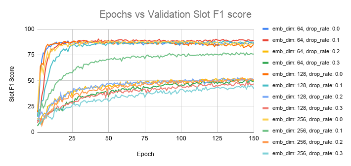

# Intent Slot Prediction using a Transformer Seq-to-Seq model

## Model details
This mode uses a three layer transformer to predict the intent and the corresponding slots for a given query. The concatenation of contextual embedding generated by the transformer encoder layer is used to predict the query intent while the decoder is used to predict the slot tokens.

## Data
This ATIS and Snips dataset were used for the experiments. Each dataset consists of three files - **seq.in** (the input queries), **seq.out** (the ground truth slots) and **label** (the query intents).

A sample structure of the dataset is shown below:

`Input: i want to fly from baltimore to dallas round trip`

`Intent: atis_flight`

`Slots: O O O O O B-fromloc.city_name O B-toloc.city_name B-round_trip I-round_trip`

## Description of files

- **model.py** : Defines the transformer based model along with the required custom layers.
- **util.py** : Defines helper functions and evaluation metrics for the training process.
- **train_model.py** : Defines the pipeline for training the model.

## Usage

Use the following command to train the model on a given dataset:

`python train_model.py --dataset='atis'`

## Evaluation Metrics
- **Intent Accuracy** - Percentage of queries for which intents were predicted correctly.
- **Slot F1 Score** -  F1 score of the slots predicted based ob IOB2 tagging.
- **Semantic Accuracy** - Percentage of queries for which both slots and intents were predicted correctly.

## Experimentation Results

### Hyperparmeters

The setting used to train the model are as follows:

- Number of Encoder/Decoder layers : 3
- Optimizer : Adam
- Number of heads : 8
- Loss : Xentintent + Xentslot (per token)

We also experimented with different values of embedding dimensions and dropout rates.

- Embedding Dimension : 64/128/256
- Dropout Rates : 0.0/0.1/0.2/0.3

The graphs corresponding to the different setting of embedding dimensions and dropout rates used for hyperprameter tuning on the Snips dataset are as follows:

 |  
 |  

The best results obtained after hyperparameter tuning are shown in tha table below:

| Dataset | Split | Slot (F1) | Intent (Acc) | Sen. (Acc) |
|---------|-------|-----------|--------------|------------|
| ATIS    | Valid | 96.57%    | 97.00%       | 88.20%     |
|         | Test  | **94.97%** | **94.73%**       | **83.54%**     |
| Snips   | Valid | 89.86%    | 98.57%       | 78.00%     |
|         | Test  | **88.78%**    | **97.00%**       | **75.43%**     |
